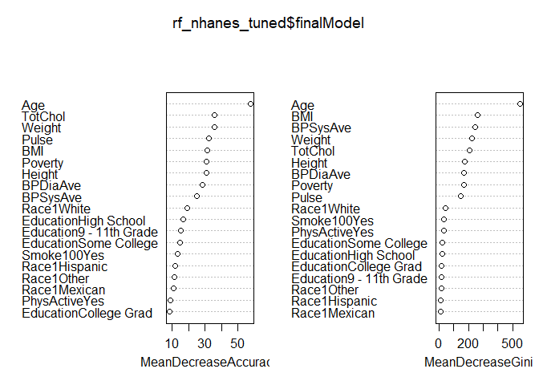
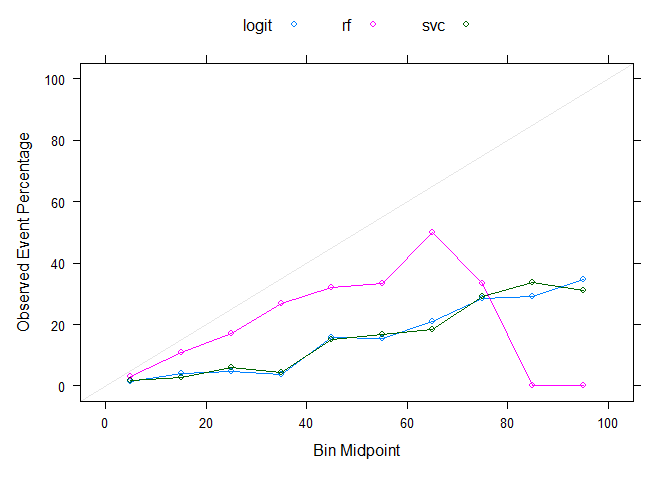
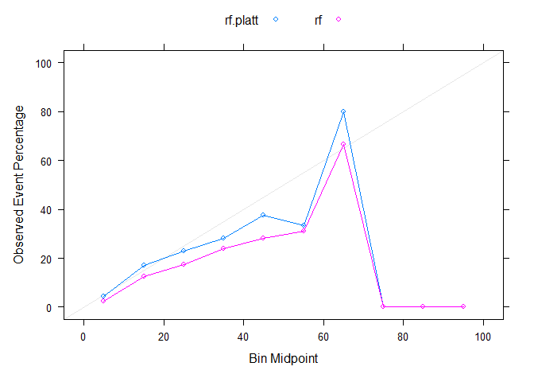
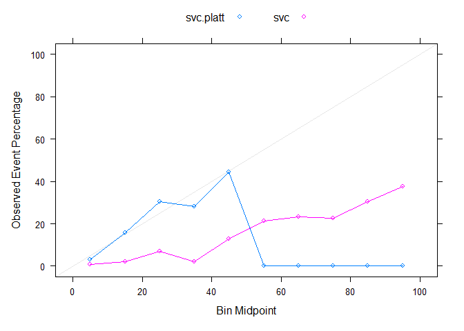

Assignment 9
================
Chee Kay Cheong
2023-03-27

``` r
knitr::opts_chunk$set(message = FALSE, warning = FALSE)

library(tidyverse)
library(lattice)
library(NHANES)
library(caret)
library(randomForest)
```

### Data Cleaning

``` r
data("NHANES")

nhanes = NHANES %>% 
  select(Age, Race1, Education, Poverty, Weight, Height, Pulse, Diabetes, BMI, PhysActive, Smoke100, BPSysAve, BPDiaAve, TotChol) %>% 
  drop_na() %>% 
  distinct()
```

### Partition data into training/testing

``` r
set.seed(123)

train.index = createDataPartition(nhanes$Diabetes, p = 0.7, list = F)
training = nhanes[train.index, ]
testing = nhanes[-train.index, ]
```

### Random Forest

From the class exercise, we found that the accuracy did not increase as
the *ntree* increased, so in this assignment we will keep *ntree* = 100.

``` r
set.seed(123)

# Try different values for mtry
mtry.grid = expand.grid(.mtry = (1:13)) 

control.settings = trainControl(method = "cv", number = 5, sampling = "up")

rf_nhanes = train(Diabetes ~ ., data = training, method = "rf", metric = "Accuracy", tuneGrid = mtry.grid, trControl = control.settings, ntree = 100, importance = TRUE)

confusionMatrix(rf_nhanes)
```

    ## Cross-Validated (5 fold) Confusion Matrix 
    ## 
    ## (entries are percentual average cell counts across resamples)
    ##  
    ##           Reference
    ## Prediction   No  Yes
    ##        No  86.5  9.6
    ##        Yes  2.0  1.8
    ##                             
    ##  Accuracy (average) : 0.8837

``` r
rf_nhanes$results
```

    ##    mtry  Accuracy     Kappa  AccuracySD    KappaSD
    ## 1     1 0.8005125 0.2921892 0.025388656 0.06373088
    ## 2     2 0.8767082 0.2094874 0.009372791 0.02313309
    ## 3     3 0.8803874 0.1680445 0.005985573 0.04714449
    ## 4     4 0.8837017 0.1930883 0.008359183 0.04879742
    ## 5     5 0.8814924 0.2053188 0.007316672 0.05447882
    ## 6     6 0.8803894 0.2324061 0.009365098 0.05320220
    ## 7     7 0.8789175 0.2236040 0.011206142 0.04833858
    ## 8     8 0.8778146 0.2233218 0.010815228 0.05454573
    ## 9     9 0.8745024 0.1916940 0.012735223 0.05909967
    ## 10   10 0.8700872 0.2055724 0.014292282 0.05668672
    ## 11   11 0.8741334 0.2180002 0.014564389 0.06822434
    ## 12   12 0.8682469 0.2104840 0.014229700 0.08260415
    ## 13   13 0.8745017 0.2264496 0.011339770 0.04963413

``` r
rf_nhanes$bestTune
```

    ##   mtry
    ## 4    4

``` r
# mtry = 4 is the best tune

mtry.grid = expand.grid(.mtry = rf_nhanes$bestTune)

rf_nhanes_tuned = train(Diabetes ~ ., data = training, method = "rf", trControl = control.settings, metric = "Accuracy", tuneGrid = mtry.grid, importance=TRUE, ntree = 100)

confusionMatrix(rf_nhanes_tuned)
```

    ## Cross-Validated (5 fold) Confusion Matrix 
    ## 
    ## (entries are percentual average cell counts across resamples)
    ##  
    ##           Reference
    ## Prediction   No  Yes
    ##        No  86.7  9.6
    ##        Yes  1.9  1.9
    ##                             
    ##  Accuracy (average) : 0.8855

``` r
varImp(rf_nhanes_tuned)
```

    ## rf variable importance
    ## 
    ##                         Importance
    ## Age                        100.000
    ## TotChol                     49.231
    ## Weight                      44.348
    ## BMI                         42.363
    ## Height                      35.506
    ## Poverty                     34.926
    ## Pulse                       33.533
    ## BPDiaAve                    31.675
    ## BPSysAve                    30.551
    ## Race1White                  21.785
    ## Education9 - 11th Grade     13.570
    ## EducationHigh School        13.099
    ## EducationSome College        9.622
    ## Smoke100Yes                  7.469
    ## Race1Hispanic                6.035
    ## Race1Other                   4.866
    ## Race1Mexican                 4.370
    ## EducationCollege Grad        1.449
    ## PhysActiveYes                0.000

``` r
varImpPlot(rf_nhanes_tuned$finalModel)
```

<!-- -->

### Model 2: Support Vector Classifier

``` r
set.seed(123)

tune_grid = expand.grid(C = seq(0.0001,100, length = 50))

control.settings = trainControl(method = "cv", number = 5, sampling = "up", classProbs = TRUE)

# Repeat expanding the grid search
svc_nhanes = train(Diabetes ~ ., data = training, method = "svmLinear", trControl = control.settings, preProcess = c("center", "scale"), probability = TRUE, tuneGrid = tune_grid)

svc_nhanes$bestTune
```

    ##          C
    ## 7 12.24499

``` r
svc_nhanes$results
```

    ##             C  Accuracy     Kappa  AccuracySD     KappaSD
    ## 1    0.000100 0.7460507 0.2712015 0.016965671 0.029447010
    ## 2    2.040914 0.7504638 0.2996522 0.009671049 0.025961082
    ## 3    4.081729 0.7497238 0.2954526 0.009392519 0.027422185
    ## 4    6.122543 0.7512011 0.2987878 0.010776437 0.009520147
    ## 5    8.163357 0.7515654 0.3011127 0.009703332 0.030582390
    ## 6   10.204171 0.7453093 0.2864941 0.009098103 0.023371683
    ## 7   12.244986 0.7592968 0.3111512 0.011285847 0.020246892
    ## 8   14.285800 0.7504597 0.2951623 0.007444201 0.028553108
    ## 9   16.326614 0.7475152 0.2902640 0.007652717 0.026680552
    ## 10  18.367429 0.7504692 0.3017898 0.013088817 0.022837733
    ## 11  20.408243 0.7541464 0.3046999 0.010448110 0.012652140
    ## 12  22.449057 0.7467799 0.2908765 0.012383581 0.025316221
    ## 13  24.489871 0.7530366 0.3016877 0.009592826 0.034262488
    ## 14  26.530686 0.7519303 0.3025437 0.009024805 0.030658645
    ## 15  28.571500 0.7497224 0.2956361 0.006575929 0.018142220
    ## 16  30.612314 0.7445760 0.2931268 0.009161437 0.023830385
    ## 17  32.653129 0.7478876 0.2944091 0.009521603 0.025805036
    ## 18  34.693943 0.7559792 0.3036718 0.013605489 0.036117212
    ## 19  36.734757 0.7523034 0.3040172 0.007965359 0.031953552
    ## 20  38.775571 0.7526676 0.2972008 0.011113495 0.019400497
    ## 21  40.816386 0.7523054 0.2999513 0.006847774 0.015851614
    ## 22  42.857200 0.7522953 0.2978169 0.009332942 0.026184364
    ## 23  44.898014 0.7519317 0.2994279 0.009875504 0.023817706
    ## 24  46.938829 0.7541376 0.3002408 0.010056838 0.023951054
    ## 25  48.979643 0.7456735 0.2912674 0.010252361 0.028681160
    ## 26  51.020457 0.7511943 0.2999494 0.015347196 0.028283401
    ## 27  53.061271 0.7508328 0.3034302 0.008317876 0.026338653
    ## 28  55.102086 0.7526724 0.3071426 0.009304129 0.014202682
    ## 29  57.142900 0.7515701 0.3011350 0.010310325 0.015536387
    ## 30  59.183714 0.7523047 0.3001837 0.011493463 0.021395541
    ## 31  61.224529 0.7530346 0.2998948 0.011789527 0.027572917
    ## 32  63.265343 0.7493595 0.2952653 0.012006224 0.023095660
    ## 33  65.306157 0.7519323 0.2962255 0.012169616 0.034476663
    ## 34  67.346971 0.7508301 0.3035530 0.010561128 0.029255504
    ## 35  69.387786 0.7515633 0.3024108 0.008364786 0.020206474
    ## 36  71.428600 0.7504624 0.2997168 0.010056063 0.029816947
    ## 37  73.469414 0.7548776 0.3031869 0.009830142 0.025529542
    ## 38  75.510229 0.7489885 0.2989998 0.010273868 0.029398059
    ## 39  77.551043 0.7467860 0.2983317 0.012623027 0.032274132
    ## 40  79.591857 0.7486215 0.2930276 0.013274599 0.029476316
    ## 41  81.632671 0.7541409 0.3056570 0.006942770 0.021715531
    ## 42  83.673486 0.7504577 0.2976057 0.008175006 0.021657896
    ## 43  85.714300 0.7504611 0.3028869 0.007611394 0.025716028
    ## 44  87.755114 0.7537719 0.3040760 0.008396570 0.021625813
    ## 45  89.795929 0.7563482 0.3064749 0.006740984 0.016955507
    ## 46  91.836743 0.7567212 0.3114406 0.014192733 0.020474288
    ## 47  93.877557 0.7530353 0.3007968 0.005171551 0.017938101
    ## 48  95.918371 0.7530394 0.3019695 0.005717229 0.014060952
    ## 49  97.959186 0.7482552 0.2960102 0.010091492 0.021735800
    ## 50 100.000000 0.7486242 0.2931816 0.015943040 0.027793936

``` r
confusionMatrix(svc_nhanes)
```

    ## Cross-Validated (5 fold) Confusion Matrix 
    ## 
    ## (entries are percentual average cell counts across resamples)
    ##  
    ##           Reference
    ## Prediction   No  Yes
    ##        No  67.0  2.5
    ##        Yes 21.6  8.9
    ##                             
    ##  Accuracy (average) : 0.7593

### Model 3: Logistic Regression

``` r
set.seed(123)

control.settings = trainControl(method = "cv", number = 5, sampling = "up")

logit_nhanes = train(Diabetes ~ ., data = training, method = "glm", family = "binomial", preProcess = c("center", "scale"), trControl = control.settings)

logit_nhanes$results
```

    ##   parameter  Accuracy     Kappa AccuracySD    KappaSD
    ## 1      none 0.7449443 0.2872659 0.01293007 0.01994497

``` r
confusionMatrix(logit_nhanes)
```

    ## Cross-Validated (5 fold) Confusion Matrix 
    ## 
    ## (entries are percentual average cell counts across resamples)
    ##  
    ##           Reference
    ## Prediction   No  Yes
    ##        No  65.7  2.7
    ##        Yes 22.8  8.8
    ##                             
    ##  Accuracy (average) : 0.7449

``` r
coef(logit_nhanes$finalModel)
```

    ##               (Intercept)                       Age             Race1Hispanic 
    ##             -0.0299598258              1.2711654901             -0.0019044612 
    ##              Race1Mexican                Race1White                Race1Other 
    ##              0.0779643578             -0.3066013994              0.2074473138 
    ## `Education9 - 11th Grade`    `EducationHigh School`   `EducationSome College` 
    ##             -0.1720856801             -0.1382293524              0.0035292225 
    ##   `EducationCollege Grad`                   Poverty                    Weight 
    ##             -0.0779982329             -0.2201333076             -1.8476597303 
    ##                    Height                     Pulse                       BMI 
    ##              1.0231555185              0.2526903162              2.4774811814 
    ##             PhysActiveYes               Smoke100Yes                  BPSysAve 
    ##             -0.0009498227              0.2307703716              0.1691937444 
    ##                  BPDiaAve                   TotChol 
    ##              0.0011036880             -0.1933529959

### Output predicted probabilities from each of the three models applied within the testing set.

``` r
# Predict in test-set and output probabilities
rf.probs = predict(rf_nhanes, testing, type = "prob")
# Interpretation: Individual #1 has 1% chance of having diabetes; Individual #2 has 23% chance of having diabetes...

# Pull out predicted probabilities for Diabetes = Yes
rf.pp = rf.probs[ , 2]

svc.probs = predict(svc_nhanes, testing, type = "prob")
# Interpretation: Individual #1 has 10% chance of having diabetes; Individual #2 has 23% chance of having diabetes...
svc.pp = svc.probs[ , 2]

# Predict in test-set using response type
logit.probs = predict(logit_nhanes, testing, type = "prob")
# Interpretation: Individual #1 has 9% chance of having diabetes; Individual #2 has 22% chance of having diabetes...
logit.pp = logit.probs[ , 2]
```

### Plot and compare calibration curves across the three algorithms.

``` r
# Put all the predicted probabilities from all three models into one dataframe so we can plot it for visualization
predicted_probs = data.frame(Class = testing$Diabetes, logit = logit.pp, rf = rf.pp, svc = svc.pp)

calibration_plot = (calibration(Class ~ logit + rf + svc, data = predicted_probs, class = "Yes", cuts = 10)) 

xyplot(calibration_plot, auto.key = list(columns = 3))
```

<!-- -->

## Post-hoc Calibration

### Calibrate the probabilities from SVC and Random Forest

#### Platt’s Scaling

Partition testing data into 2 sets: 1 set to train calibration and 1 set
to evaluate results

``` r
set.seed(123)

# Partition testing data into a 50/50 split
test.index = testing$Diabetes %>% createDataPartition(p = 0.5, list = F)

# One set for calibration
calibration_data = testing[test.index, ]
# Another set for testing
final.test.data = testing[-test.index, ]
```

**Calibration of Random Forest**

``` r
# Predict on test set without scaling to obtain raw predicted probabilities in test set
rf.probs.nocal = predict(rf_nhanes, final.test.data, type = "prob")
rf.pp.nocal = rf.probs.nocal[ , 2]

# Apply model developed on training data to calibration dataset to obtain predictions
rf.probs.cal = predict(rf_nhanes, calibration_data, type = "prob")
rf.pp.cal = rf.probs.cal[ , 2]

# Add to dataset with actual values from calibration data
rf_cal_df = data.frame(rf.pp.cal, calibration_data$Diabetes)
colnames(rf_cal_df) = c("x", "y")

# Use logistic regression to model predicted probabilities from calibration data to actual vales
rf_calibrated = glm(y ~ x, data = rf_cal_df, family = binomial)

# Apply calibration model above to raw predicted probabilities from test set
rf_test_df = data.frame(rf.pp.nocal)
colnames(rf_test_df) = c("x")
platt.data.rf = predict(rf_calibrated, rf_test_df, type = "response")

platt.prob.rf = data.frame(Class = final.test.data$Diabetes, rf.platt = platt.data.rf, rf = rf.pp.nocal)

calplot.rf = (calibration(Class ~ rf.platt + rf, data = platt.prob.rf, class = "Yes", cuts = 10))
xyplot(calplot.rf, auto.key = list(columns = 2))
```

<!-- -->

**Calibration of SVC**

``` r
# Predict on test-set without scaling
svc.nocal = predict(svc_nhanes, final.test.data, type = "prob")
svc.pp.nocal = svc.nocal[ , 2]

# Apply model developed on training data to calibration dataset to obtain predictions
svc.cal = predict(svc_nhanes, calibration_data, type = "prob")
svc.pp.cal = svc.cal[ , 2]

# Add to dataset with actual values from calibration data
svc_cal_df = data.frame(svc.pp.cal, calibration_data$Diabetes)
colnames(svc_cal_df) = c("x", "y")

# Use logistic regression to model predicted probabilities from calibration data to actual vales
svc_calibrated = glm(y ~ x, data = svc_cal_df, family = binomial)

# Predict on test set using model developed in calibration
svc_test_df = data.frame(svc.pp.nocal)
colnames(svc_test_df) = c("x")
platt.data.svc = predict(svc_calibrated, svc_test_df, type = "response")

platt.prob.svc = data.frame(Class = final.test.data$Diabetes, svc.platt = platt.data.svc, svc = svc.pp.nocal)

calplot.svc = (calibration(Class ~ svc.platt + svc, data = platt.prob.svc, class = "Yes", cuts = 10))
xyplot(calplot.svc, auto.key = list(columns = 2))
```

<!-- -->

### Choose the “optimal” model

According to both the pre- and post-calibration plots, I think the
**Random Forest** model would be the best model among all three models.
In the pre-calibration plot, the random forest model is the one closest
to the diagonal line. In the post-calibration plot for random forest,
the predictions of diabetes are close to the diagonal line up until
65-70%. In contrast, the SVC model (in the post-calibration plot) is
only well-calibrated up until 45-50%.

### Additional Evaluation

If the goal was to implement this model within a clinical setting, I
would perform a ConfusionMatrix and ROC curve to determine the
sensitivity and specificity of the model, so that I can ensure that this
calibrated model is accurate, reliable, and appropriate.
