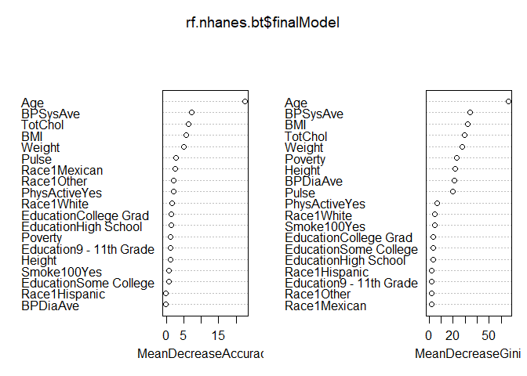
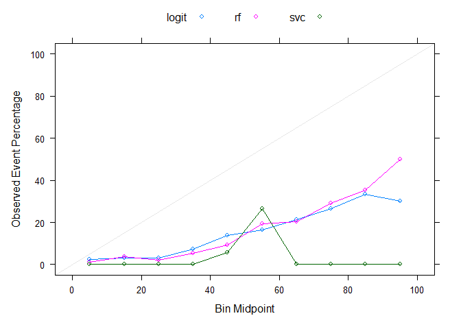
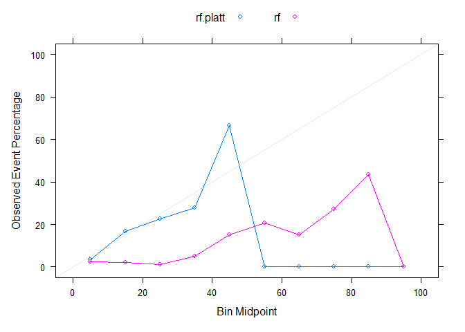
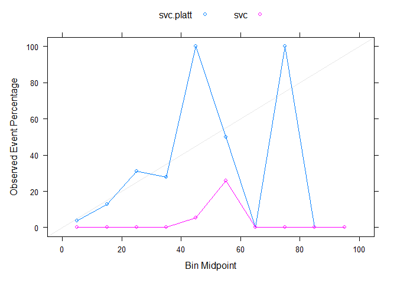

Clinical Prediction Pipeline
================
JAS

``` r
knitr::opts_chunk$set(message = FALSE, warning = FALSE)

library(tidyverse)
library(lattice)
library(NHANES)
library(dplyr)
library(caret)
library(randomForest)
```

## Exercise: Comparison between Random Forest, SVC and Logistic Regression for Clinical Risk Scores

This exercise uses the same data as Assignment 6. You will use three
different algorithms (random forest, SVC and logistic regression) to
generate a clinical **risk score** for diabetes. We will then compare
the three models.

For this exercise, the code will perform the following:

1.  Run the code chunk `dataprep` below to load and subset the data.

2.  Partition data into a 70/30 training/testing split.

3.  Construct three models in the training set using each of the three
    algorithms to predict diabetes. You can use `caret` for all three,
    or the individual packages `randomforest`, `glmnet`, and `stats`.
    For the random forest, try 3 different values of *mtry*. For SVC,
    vary the cost parameter using a vector of values you create, as
    you’ve done in previous assignments.

4.  Compare accuracy across the three models in the training set.

------------------------------------------------------------------------

The calculation of the clinical risk scores will be demonstrated within
class.As a group, we will do the following:

5.  Output predicted probabilities from each of the three models applied
    within the testing set.

6.  Plot and compare calibration curves across the three algorithms.

7.  Calibrate the predicted probabilities from SVC and Random Forest
    using two common methods.

8.  Plot and compare the new calibration curves across the three
    algorithms.

------------------------------------------------------------------------

The code below will load the data and process it.

1.  Subsetting the data to only include the relevent features
2.  Removing observations with missing values

Remember from our prior assignment the data are imbalanced, so we will
need to deal with this during our analysis.

### Data Cleaning

``` r
data("NHANES")

# Check how many Yes/No diabetes
table(NHANES$Diabetes)
```

    ## 
    ##   No  Yes 
    ## 9098  760

``` r
keep.var = names(NHANES) %in% c("Age", "Race1", "Education", "Poverty", "Weight", "Height", "Pulse", "Diabetes", "BMI", "PhysActive", "Smoke100", "BPSysAve", "BPDiaAve", "TotChol")

NHANES.subset = NHANES[keep.var]

str(NHANES.subset)
```

    ## tibble [10,000 × 14] (S3: tbl_df/tbl/data.frame)
    ##  $ Age       : int [1:10000] 34 34 34 4 49 9 8 45 45 45 ...
    ##  $ Race1     : Factor w/ 5 levels "Black","Hispanic",..: 4 4 4 5 4 4 4 4 4 4 ...
    ##  $ Education : Factor w/ 5 levels "8th Grade","9 - 11th Grade",..: 3 3 3 NA 4 NA NA 5 5 5 ...
    ##  $ Poverty   : num [1:10000] 1.36 1.36 1.36 1.07 1.91 1.84 2.33 5 5 5 ...
    ##  $ Weight    : num [1:10000] 87.4 87.4 87.4 17 86.7 29.8 35.2 75.7 75.7 75.7 ...
    ##  $ Height    : num [1:10000] 165 165 165 105 168 ...
    ##  $ BMI       : num [1:10000] 32.2 32.2 32.2 15.3 30.6 ...
    ##  $ Pulse     : int [1:10000] 70 70 70 NA 86 82 72 62 62 62 ...
    ##  $ BPSysAve  : int [1:10000] 113 113 113 NA 112 86 107 118 118 118 ...
    ##  $ BPDiaAve  : int [1:10000] 85 85 85 NA 75 47 37 64 64 64 ...
    ##  $ TotChol   : num [1:10000] 3.49 3.49 3.49 NA 6.7 4.86 4.09 5.82 5.82 5.82 ...
    ##  $ Diabetes  : Factor w/ 2 levels "No","Yes": 1 1 1 1 1 1 1 1 1 1 ...
    ##  $ PhysActive: Factor w/ 2 levels "No","Yes": 1 1 1 NA 1 NA NA 2 2 2 ...
    ##  $ Smoke100  : Factor w/ 2 levels "No","Yes": 2 2 2 NA 2 NA NA 1 1 1 ...

``` r
#Remove missings and then remove duplicates
NHANES.subset<-na.omit(NHANES.subset)
NHANES.subset<-unique(NHANES.subset)

# Check distributions
summary(NHANES.subset)
```

    ##       Age             Race1               Education       Poverty     
    ##  Min.   :20.00   Black   : 531   8th Grade     : 266   Min.   :0.000  
    ##  1st Qu.:32.00   Hispanic: 258   9 - 11th Grade: 511   1st Qu.:1.240  
    ##  Median :46.00   Mexican : 390   High School   : 828   Median :2.635  
    ##  Mean   :47.25   White   :2390   Some College  :1194   Mean   :2.783  
    ##  3rd Qu.:60.00   Other   : 311   College Grad  :1081   3rd Qu.:4.650  
    ##  Max.   :80.00                                         Max.   :5.000  
    ##      Weight           Height           BMI            Pulse       
    ##  Min.   : 37.00   Min.   :139.9   Min.   :15.02   Min.   : 40.00  
    ##  1st Qu.: 67.50   1st Qu.:161.3   1st Qu.:24.20   1st Qu.: 64.00  
    ##  Median : 79.80   Median :168.6   Median :27.80   Median : 72.00  
    ##  Mean   : 82.55   Mean   :168.7   Mean   :28.95   Mean   : 72.45  
    ##  3rd Qu.: 93.90   3rd Qu.:175.8   3rd Qu.:32.34   3rd Qu.: 80.00  
    ##  Max.   :230.70   Max.   :200.4   Max.   :81.25   Max.   :128.00  
    ##     BPSysAve      BPDiaAve         TotChol       Diabetes   PhysActive
    ##  Min.   : 78   Min.   :  0.00   Min.   : 1.530   No :3437   No :1850  
    ##  1st Qu.:109   1st Qu.: 63.00   1st Qu.: 4.290   Yes: 443   Yes:2030  
    ##  Median :119   Median : 70.00   Median : 4.990                        
    ##  Mean   :121   Mean   : 69.93   Mean   : 5.051                        
    ##  3rd Qu.:130   3rd Qu.: 78.00   3rd Qu.: 5.690                        
    ##  Max.   :226   Max.   :116.00   Max.   :13.650                        
    ##  Smoke100  
    ##  No :2161  
    ##  Yes:1719  
    ##            
    ##            
    ##            
    ## 

``` r
# Tidyverse way of cleaning data
nhanes = NHANES %>% 
  select(Age, Race1, Education, Poverty, Weight, Height, Pulse, Diabetes, BMI, PhysActive, Smoke100, BPSysAve, BPDiaAve, TotChol) %>% 
  drop_na() %>% 
  distinct()
```

### Set up: Partition data into training/testing

``` r
set.seed(123)

training.data = createDataPartition(NHANES.subset$Diabetes, p = 0.7, list = F)
train.data = NHANES.subset[training.data, ]
test.data = NHANES.subset[-training.data, ]
```

### Model 1: Random Forest with 3 values of mtry and 3 values of ntree

``` r
# Try mtry of all, half of all, sqrt of all, 
feat.count = c((ncol(train.data)-1), (ncol(train.data)-1)/2, sqrt(ncol(train.data)-1))
grid.rf = expand.grid(mtry = feat.count)

# Try ntree of 100, 300, 500
tree.num = seq(100, 500, by =200)
results.trees = list()

control.obj = trainControl(method = "cv", number = 5, sampling = "down")

for (ntree in tree.num){
  set.seed(123)
    rf.nhanes = train(Diabetes ~ ., data = train.data, method = "rf", ntree = ntree, trControl = control.obj, metric = "Accuracy", tuneGrid = grid.rf, importance = TRUE)
    index = toString(ntree) 
  results.trees[[index]] = rf.nhanes$results
}

output.nhanes = bind_rows(results.trees, .id = "ntrees")
# As we can see from the table, the accuracy did not increase much (even decreased) as the number of trees increases, 
# so we know we don't have to go to 300 or 500 trees. Just stick with 100 trees.

best.tune = output.nhanes[which.max(output.nhanes[, "Accuracy"]), ]
best.tune$mtry
```

    ## [1] 3.605551

``` r
results.trees
```

    ## $`100`
    ##        mtry  Accuracy     Kappa AccuracySD    KappaSD
    ## 1  3.605551 0.7372258 0.2785693 0.02679767 0.03469265
    ## 2  6.500000 0.7287570 0.2679049 0.01602345 0.02322449
    ## 3 13.000000 0.7287503 0.2780671 0.01627787 0.02683816
    ## 
    ## $`300`
    ##        mtry  Accuracy     Kappa AccuracySD    KappaSD
    ## 1  3.605551 0.7353862 0.2771587 0.02334286 0.02953987
    ## 2  6.500000 0.7357478 0.2830531 0.01350320 0.02239222
    ## 3 13.000000 0.7272770 0.2783977 0.01538042 0.02460268
    ## 
    ## $`500`
    ##        mtry  Accuracy     Kappa AccuracySD    KappaSD
    ## 1  3.605551 0.7364885 0.2783052 0.02144117 0.02342627
    ## 2  6.500000 0.7346468 0.2819872 0.01765780 0.02822368
    ## 3 13.000000 0.7280143 0.2781589 0.01551600 0.02687186

``` r
mtry.grid = expand.grid(.mtry = best.tune$mtry)

set.seed(123)
    rf.nhanes.bt = train(Diabetes ~ ., data = train.data, method = "rf", trControl = control.obj, metric = "Accuracy", tuneGrid = mtry.grid, importance=TRUE, ntree = as.numeric(best.tune$ntrees))

confusionMatrix(rf.nhanes.bt)
```

    ## Cross-Validated (5 fold) Confusion Matrix 
    ## 
    ## (entries are percentual average cell counts across resamples)
    ##  
    ##           Reference
    ## Prediction   No  Yes
    ##        No  63.7  2.5
    ##        Yes 24.8  8.9
    ##                             
    ##  Accuracy (average) : 0.7265

``` r
varImp(rf.nhanes.bt)
```

    ## rf variable importance
    ## 
    ##                         Importance
    ## Age                       100.0000
    ## BPSysAve                   31.9543
    ## TotChol                    29.3016
    ## BMI                        25.4238
    ## Weight                     22.7719
    ## Pulse                      12.5897
    ## Race1Mexican               11.7541
    ## PhysActiveYes              10.9035
    ## Race1Other                 10.3957
    ## Race1White                  9.0814
    ## Education9 - 11th Grade     7.9795
    ## EducationCollege Grad       7.4678
    ## Poverty                     6.8586
    ## Height                      5.9749
    ## EducationHigh School        5.9134
    ## Smoke100Yes                 5.2558
    ## EducationSome College       4.3556
    ## BPDiaAve                    0.4454
    ## Race1Hispanic               0.0000

``` r
varImpPlot(rf.nhanes.bt$finalModel)
```

<!-- -->

### Model 2: Support Vector Classifier

``` r
set.seed(123)

control.obj = trainControl(method = "cv", number = 5, sampling = "down", classProbs = TRUE)

# Repeat expanding the grid search
set.seed(123)

svc.nhanes = train(Diabetes ~ ., data = train.data, method = "svmLinear", trControl = control.obj, preProcess = c("center", "scale"), probability = TRUE, tuneGrid = expand.grid(C = seq(0.0001,100, length = 10)))

svc.nhanes$bestTune
```

    ##       C
    ## 1 1e-04

``` r
svc.nhanes$results
```

    ##           C  Accuracy     Kappa  AccuracySD    KappaSD
    ## 1    0.0001 0.7478930 0.2581748 0.027758906 0.03167478
    ## 2   11.1112 0.7475152 0.2996027 0.007194599 0.01653553
    ## 3   22.2223 0.7368419 0.2889089 0.005829215 0.02044865
    ## 4   33.3334 0.7379482 0.2911235 0.018815286 0.04281053
    ## 5   44.4445 0.7390552 0.2839301 0.008481328 0.03207932
    ## 6   55.5556 0.7379482 0.2797352 0.008709932 0.01285504
    ## 7   66.6667 0.7375860 0.2836026 0.011380752 0.03201817
    ## 8   77.7778 0.7368527 0.2740273 0.015659266 0.02042371
    ## 9   88.8889 0.7386923 0.2864715 0.016311609 0.02457097
    ## 10 100.0000 0.7434683 0.2964763 0.011650988 0.01634600

``` r
confusionMatrix(svc.nhanes)
```

    ## Cross-Validated (5 fold) Confusion Matrix 
    ## 
    ## (entries are percentual average cell counts across resamples)
    ##  
    ##           Reference
    ## Prediction   No  Yes
    ##        No  67.1  3.8
    ##        Yes 21.5  7.7
    ##                             
    ##  Accuracy (average) : 0.7479

### Model 3: Logistic Regression

``` r
set.seed(123)

control.obj = trainControl(method = "cv", number = 5, sampling = "down")

logit.nhanes = train(Diabetes ~ ., data = train.data, method = "glm", family = "binomial", preProcess = c("center", "scale"), trControl = control.obj)

logit.nhanes$results
```

    ##   parameter  Accuracy    Kappa  AccuracySD  KappaSD
    ## 1      none 0.7390485 0.287464 0.008935995 0.035321

``` r
confusionMatrix(logit.nhanes)
```

    ## Cross-Validated (5 fold) Confusion Matrix 
    ## 
    ## (entries are percentual average cell counts across resamples)
    ##  
    ##           Reference
    ## Prediction   No  Yes
    ##        No  64.9  2.4
    ##        Yes 23.7  9.0
    ##                             
    ##  Accuracy (average) : 0.7391

``` r
coef(logit.nhanes$finalModel)
```

    ##               (Intercept)                       Age             Race1Hispanic 
    ##              -0.024753208               1.376564226              -0.188249727 
    ##              Race1Mexican                Race1White                Race1Other 
    ##              -0.081889338              -0.325159936               0.159648034 
    ## `Education9 - 11th Grade`    `EducationHigh School`   `EducationSome College` 
    ##              -0.443942068              -0.307673895              -0.200202953 
    ##   `EducationCollege Grad`                   Poverty                    Weight 
    ##              -0.409247247              -0.221784229              -1.993582660 
    ##                    Height                       BMI                     Pulse 
    ##               1.065985576               2.522948416               0.282872782 
    ##                  BPSysAve                  BPDiaAve                   TotChol 
    ##               0.147122073              -0.002855642              -0.312927399 
    ##             PhysActiveYes               Smoke100Yes 
    ##              -0.037000150               0.161001919

### Output predicted probabilities from each of the three models applied within the testing set.

``` r
# Predict in test-set and output probabilities
rf.probs = predict(rf.nhanes, test.data, type = "prob")
# Interpretation: Individual #1 has 9% chance of having diabetes; Individual #2 has 58.4% chance of having diabetes...

# Pull out predicted probabilities for Diabetes = Yes
rf.pp = rf.probs[ , 2]

svc.probs = predict(svc.nhanes, test.data, type = "prob")
# SVC predicted that almost everyone has ~50% of having diabetes (useless information).
svc.pp = svc.probs[ , 2]

# Predict in test-set using response type
logit.probs = predict(logit.nhanes, test.data, type = "prob")
logit.pp = logit.probs[ , 2]
```

### Plot and compare calibration curves across the three algorithms.

``` r
# Put all the predicted probabilities from all three models into one dataframe so we can plot it for visualization
pred.prob = data.frame(Class = test.data$Diabetes, logit = logit.pp, rf = rf.pp, svc = svc.pp)

# Define 'cuts': If cuts = 5, 0-20 will be in one bin, 20-40 in one bin, ... 
# If cuts = 10, 0-10 in one bin, 10-20 in one bin, ...
calplot = (calibration(Class ~ logit + rf + svc, data = pred.prob, class = "Yes", cuts = 10)) 

xyplot(calplot, auto.key = list(columns = 3))
```

<!-- -->

``` r
# Based on the plot, for those who have 20% chance of having diabetes, the models estimated them to more than 20% chance of having diabetes (so overestimated).
```

## Post-hoc methods

### Calibrate the probabilities from SVC and RF

Partition testing data into 2 sets: set to train calibration and then
set to evaluate results

Method 1: Platt’s Scaling-train a logistic regression model on the
outputs of your classifier

``` r
set.seed(123)
# Partition test data into 50/50 split
cal.data.index = test.data$Diabetes %>% createDataPartition(p = 0.5, list = F)
# One set for calibration
cal.data = test.data[cal.data.index, ]
# Another set for testing
final.test.data = test.data[-cal.data.index, ]

#Calibration of RF

#Predict on test-set without scaling to obtain raw pred prob in test set
rf.probs.nocal = predict(rf.nhanes, final.test.data, type = "prob")
rf.pp.nocal = rf.probs.nocal[ , 2]

#Apply model developed on training data to calibration dataset to obtain predictions
rf.probs.cal = predict(rf.nhanes, cal.data, type = "prob")
rf.pp.cal = rf.probs.cal[ , 2]

#Add to dataset with actual values from calibration data
calibrf.data.frame = data.frame(rf.pp.cal, cal.data$Diabetes)
colnames(calibrf.data.frame) = c("x", "y")

#Use logistic regression to model predicted probabilities from calibration data to actual vales
calibrf.model = glm(y ~ x, data = calibrf.data.frame, family = binomial)

#Apply calibration model above to raw predicted probabilities from test set
data.test.rf = data.frame(rf.pp.nocal)
colnames(data.test.rf) = c("x")
platt.data.rf = predict(calibrf.model, data.test.rf, type = "response")

platt.prob.rf = data.frame(Class = final.test.data$Diabetes, rf.platt = platt.data.rf, rf = rf.pp.nocal)

calplot.rf = (calibration(Class ~ rf.platt + rf, data = platt.prob.rf, class = "Yes", cuts = 10))
xyplot(calplot.rf, auto.key = list(columns = 2))
```

<!-- -->

``` r
#Calibration of SVC

#Predict on test-set without scaling
svc.nocal = predict(svc.nhanes, final.test.data, type = "prob")
svc.pp.nocal = svc.nocal[ , 2]

#Apply model developed on training data to calibration dataset to obtain predictions
svc.cal = predict(svc.nhanes, cal.data, type = "prob")
svc.pp.cal = svc.cal[ , 2]

#Add to dataset with actual values from calibration data
calib.data.frame = data.frame(svc.pp.cal, cal.data$Diabetes)
colnames(calib.data.frame) = c("x", "y")
calib.model = glm(y ~ x, data = calib.data.frame, family = binomial)

#Predict on test set using model developed in calibration
data.test = data.frame(svc.pp.nocal)
colnames(data.test) = c("x")
platt.data = predict(calib.model, data.test, type = "response")

platt.prob = data.frame(Class = final.test.data$Diabetes, svc.platt = platt.data, svc = svc.pp.nocal)

calplot = (calibration(Class ~ svc.platt + svc, data = platt.prob, class = "Yes", cuts = 10))
xyplot(calplot, auto.key = list(columns = 2))
```

<!-- -->
